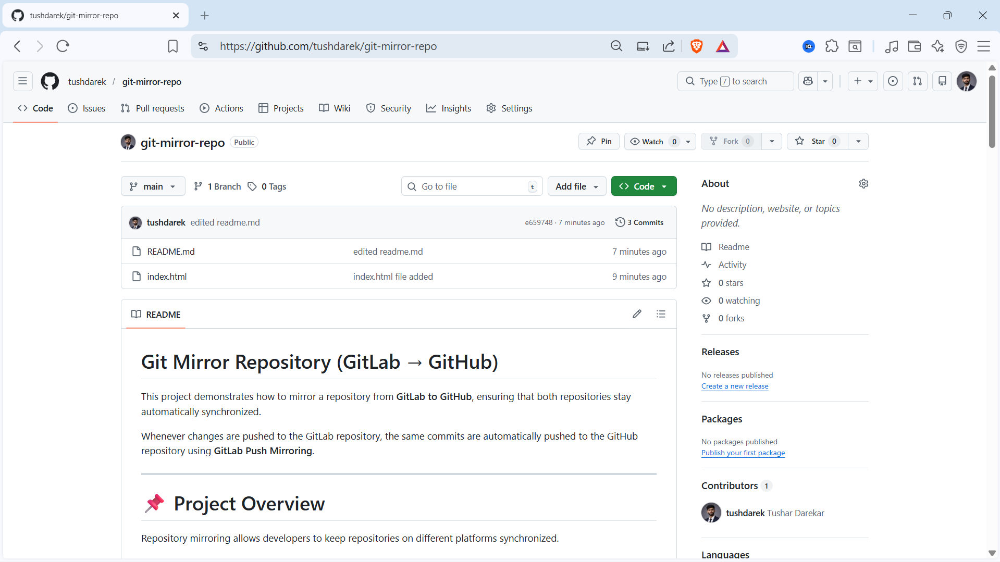
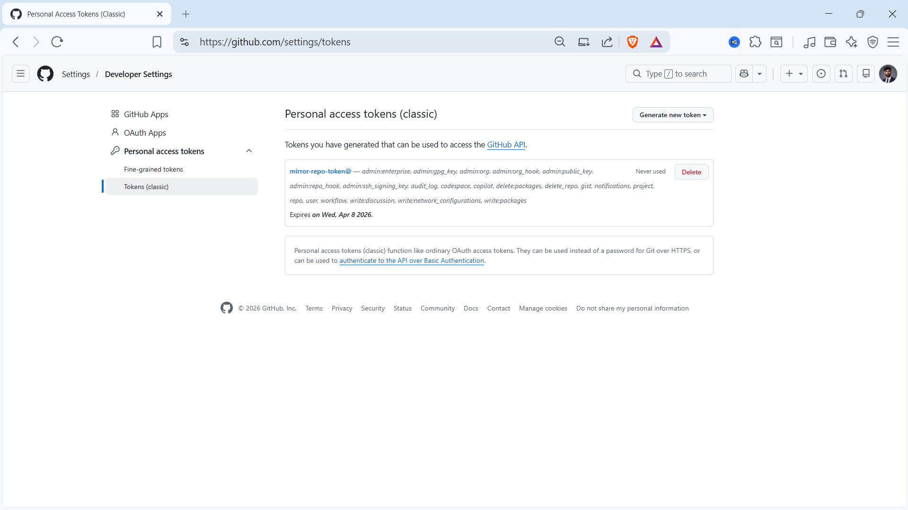
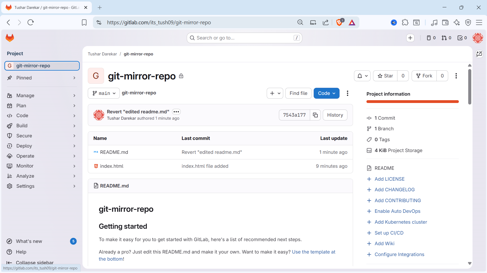
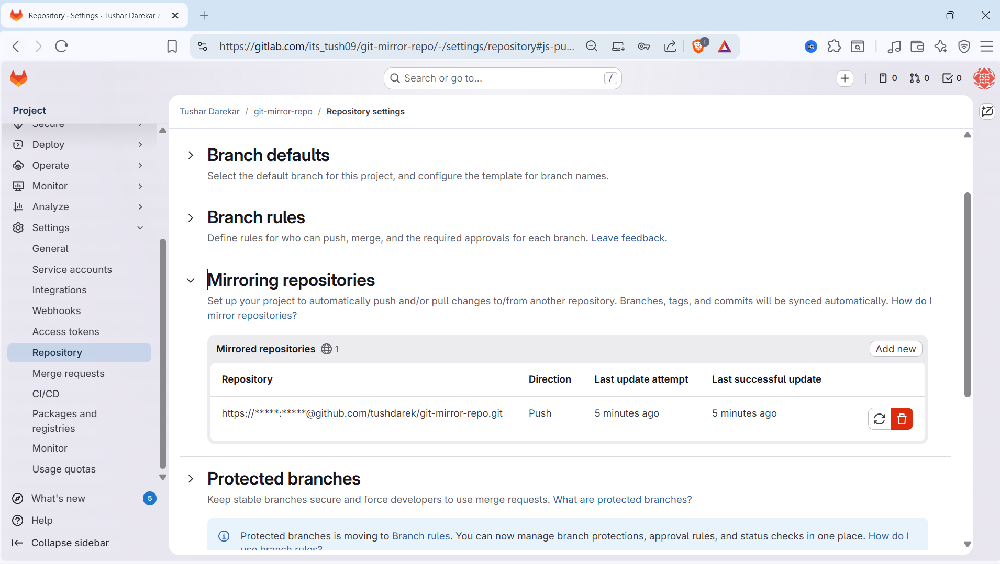
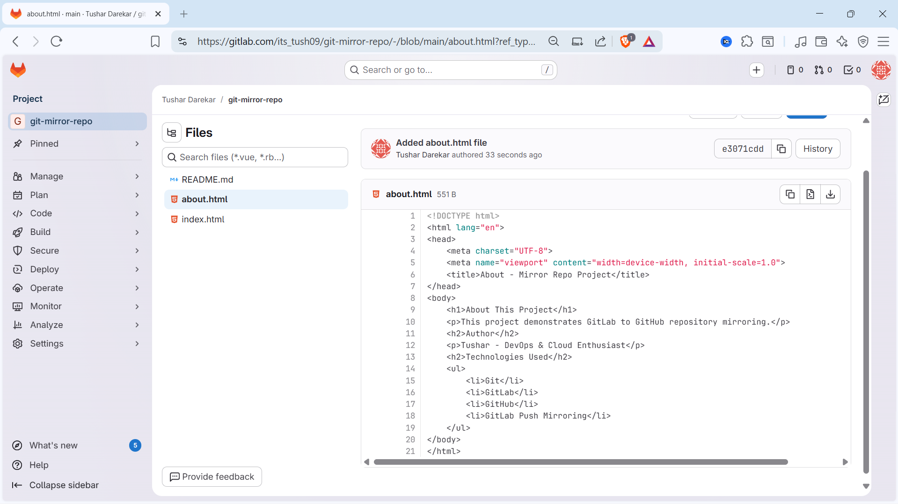
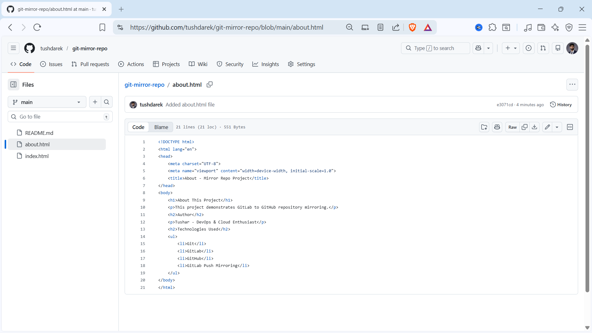

# 🔁 GitLab to GitHub Repository Mirroring

This project demonstrates how to mirror a repository from GitLab to GitHub, ensuring that both repositories remain automatically synchronized.

Whenever changes are pushed to the GitLab repository, the same commits are automatically pushed to the GitHub repository using **GitLab Push Mirroring**.

---

## 📌 Project Overview

Repository mirroring allows developers to maintain synchronized repositories across different platforms.

In this project:
- **GitLab** is used as the primary repository
- **GitHub** acts as the mirror repository
- Every commit pushed to GitLab is automatically mirrored to GitHub

This approach ensures **backup**, **redundancy**, and **cross-platform availability** of your code.

---

## 🚀 Features

- ✅ Automatic synchronization between GitLab and GitHub
- ✅ Backup repository for redundancy
- ✅ Cross-platform repository availability
- ✅ Easy configuration using GitLab mirroring feature
- ✅ Secure authentication using GitHub Personal Access Token

---

## 🛠 Technologies Used

| Tool | Purpose |
|------|---------|
| Git | Version control |
| GitLab | Primary repository |
| GitHub | Mirror repository |
| GitLab Push Mirroring | Auto-sync mechanism |
| Personal Access Token (PAT) | Secure authentication |

---

## ⚙️ Project Workflow

```
Developer
   │
   ▼
GitLab Repository (Primary)
   │
   ▼
Push Mirroring
   │
   ▼
GitHub Repository (Mirror)
```

> Every commit pushed to GitLab will automatically sync with GitHub.

---

## 📋 Implementation Steps

### Step 1: Create Repository in GitHub

1. Login to GitHub
2. Click **New Repository**
3. Enter repository name
4. Initialize with `README.md`
5. Click **Create Repository**

📸 **Screenshot — GitHub Repository Creation:**



---

### Step 2: Generate GitHub Personal Access Token

Navigate to:
```
GitHub → Settings → Developer Settings → Personal Access Tokens
```

Click **Generate New Token (Classic)** and select the `repo` permission scope.

> ⚠️ Copy the token immediately — it will be used as the password in GitLab mirror configuration.

📸 **Screenshot — Token Generation:**



---

### Step 3: Create Blank Project in GitLab

1. Login to GitLab
2. Click **New Project**
3. Select **Blank Project**
4. Enter project name
5. Initialize repository with README
6. Click **Create Project**

📸 **Screenshot — GitLab Project Creation:**



---

### Step 4: Configure Mirror Repository in GitLab

Navigate to:
```
Project → Settings → Repository → Mirroring Repositories
```

Click **Mirror Repository** and enter your GitHub repository URL:
```
https://<GITHUB_USERNAME>@github.com/<GITHUB_USERNAME>/<REPOSITORY_NAME>.git
```

Set mirror direction to **Push**.

📸 **Screenshot — GitLab Mirror Configuration:**



---

### Step 5: Authenticate Using GitHub Token

Provide credentials:
```
Username : <Your GitHub Username>
Password : <Your GitHub Personal Access Token>
```

Click **Mirror Repository** — GitLab will now automatically push updates to GitHub.

---

### Step 6: Clone GitLab Repository and Push Code

Clone the GitLab repository:
```bash
git clone https://gitlab.com/<GITLAB_USERNAME>/<REPOSITORY>.git
cd <REPOSITORY>
```

Create the project files:
```bash
touch index.html
touch about.html
```

Commit and push:
```bash
git add index.html about.html
git commit -m "Added index.html and about.html files"
git push -u origin main
```

📸 **Screenshot — Files Pushed to GitLab:**



---

## ✅ Verification

After pushing to GitLab, wait a few seconds for the mirror sync, then open your GitHub repository — the same files will appear automatically.

📸 **Screenshot — Files Mirrored to GitHub:**



> This confirms **GitLab → GitHub mirroring is working successfully** ✅

---

## 📂 Repository Structure

```
git-mirror-repo
│
├── README.md
├── index.html
├── about.html
└── screenshots
    ├── 1-github-repo.png
    ├── 2-token-generation.png
    ├── 3-gitlab-project.png
    ├── 4-mirror-settings.png
    ├── 5-gitlab-push.png
    └── 6-github-mirror.png
```

---

## 🎯 Benefits of Repository Mirroring

| Benefit | Description |
|--------|-------------|
| 🔒 Backup | Redundant copy on a second platform |
| 🌍 Cross-platform | Available on both GitLab and GitHub |
| ⚡ High Availability | Source code always accessible |
| 🔄 Auto Sync | No manual steps after setup |
| 🚀 Easy Migration | Simplifies moving between platforms |

---

## 📄 License

This project is created for **educational and demonstration purposes**.

---

## 👨‍💻 Author

**Tushar** — DevOps & Cloud Enthusiast